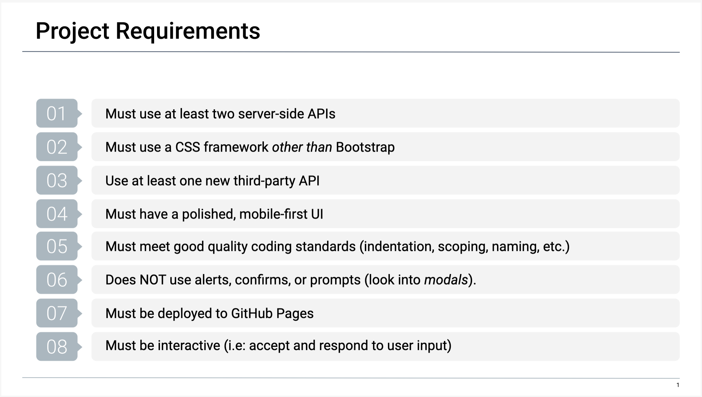
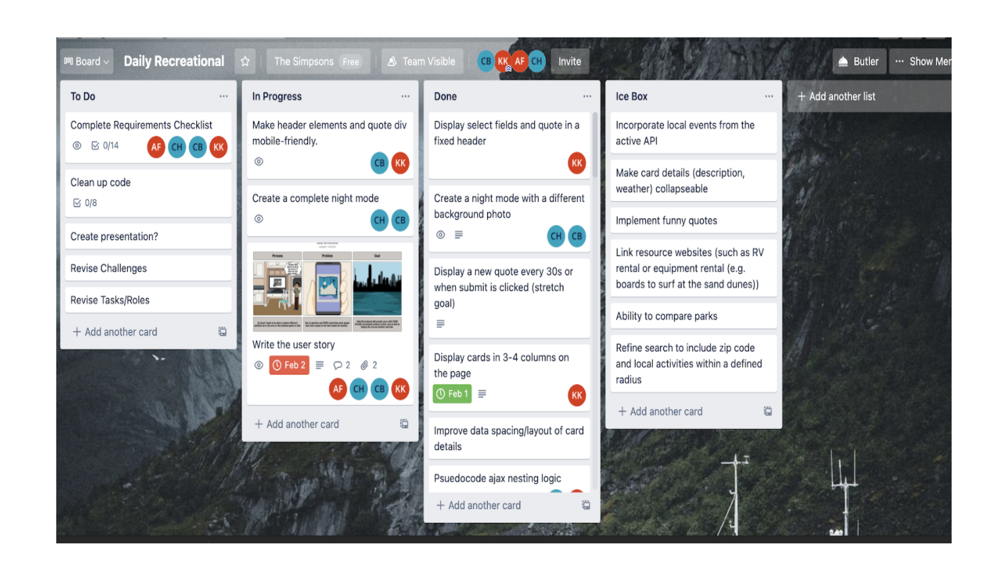
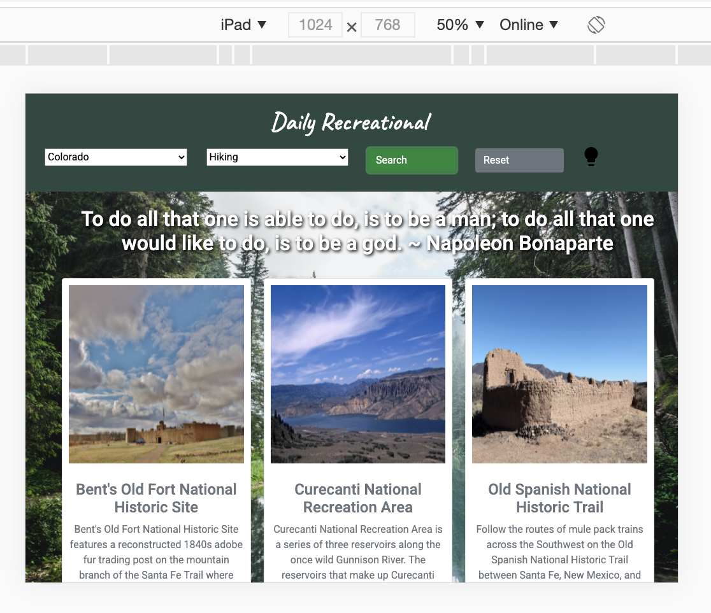
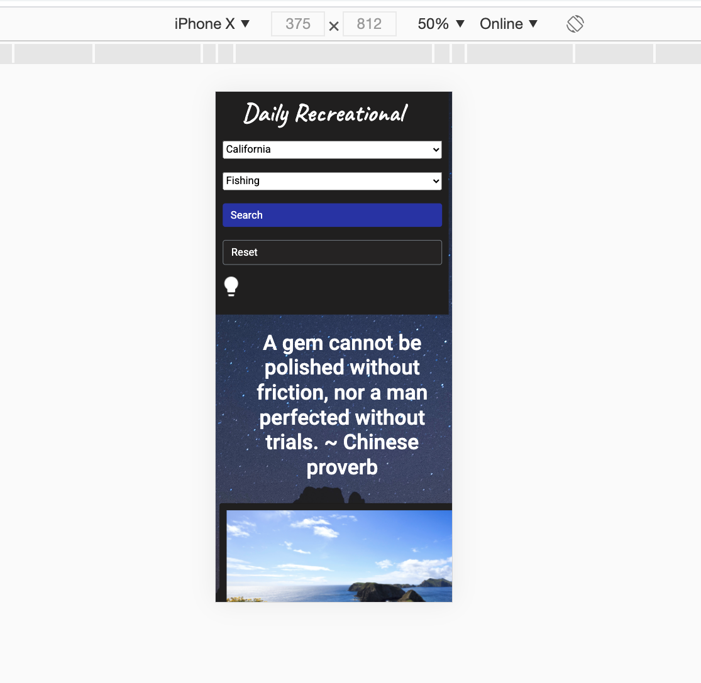

# uofm-bootcamp-project1
Project 1: Daily Recreational

Requirements: 

## Author's Notes
* We started the initial project by voting on an app to create, assigning a project manager (Kyle), and dividing the tasks between the front end(Chris and Asli) and the back end (Kyle and Carolyn).  We followed up with a Trello board.   
* Everyone had access to the board and could create, move, and modify the cards.
* We used the board to create the beginning tasks necessary to start the project.  

# Daily Recreational
We chose the name of Daily Recreational for our project.   

# Description
Daily Recreational is here to inspire you to get out of the house and rekindle your love for outdoor activities. Daily Recreational provides you with an inspirational quote to brighten your day, paired with useful information on National Parks based on your desired state and activity. Whether you like birdwatching or mountain climbing, the Daily Recreational is your source for getting in a positively active mindset.

# Visuals
One of the major requirements was a responsive site.   Below are different sized versions.
## Desktop:

## iPad:

## iPhone:

# Usage
We had several things populate to the cards dynamically. We had the park name, a park photo, the park description, a link to the park, the park weather (based on the latitude and longitude of the park), and the contact info for the park.

### Card info:

We also had to create a response for a search that created no results.

### No Result: 

### Dark/Light Mode
We also made a toggle for light and dark by placing a button in the header.

 

# Roadmap
For the future, there are a few ideas for app expansion:
*  An incorporation of more local events to include -  but not be limited to - state and local parks.   
* Along with more places a zip code radius to show the closest activities and return them in ascending order of proximity. 
* With all of the additional information, collpsable cards would be beneficial to hold more on the page.  
* An introduction of equipment rental and traveler tips that are specific to adventures offered at each location.  
* Eventually an expansion to an international app and an inclusion of more inspirational and entertaining quotes.

# Authors 
Kyle Kleven: https://github.com/kdkleven 
Carolyn Hilpisch: https://github.com/ckhilpisch 
Chris Boisjoli: https://github.com/ChrisBoisjoli 
 

# License
For open source projects, say how it is licensed.

# The Website:
https://ckhilpisch.github.io/Daily-Recreational/